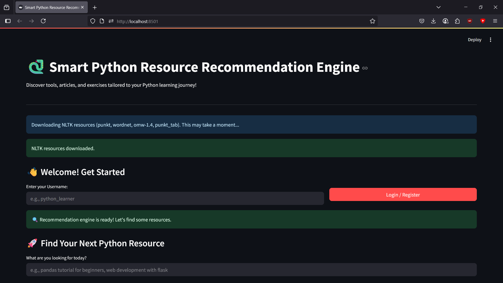
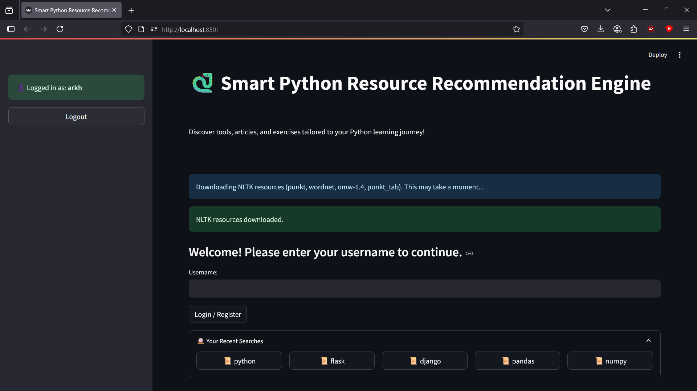
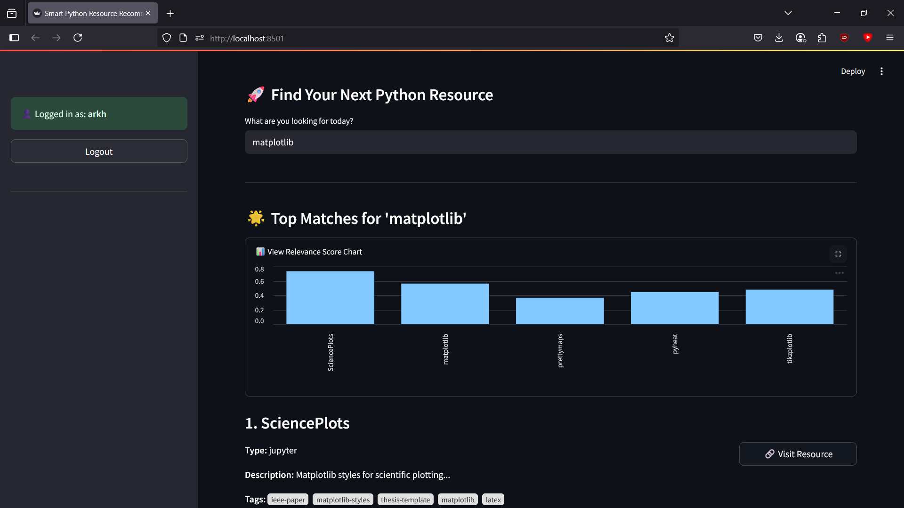
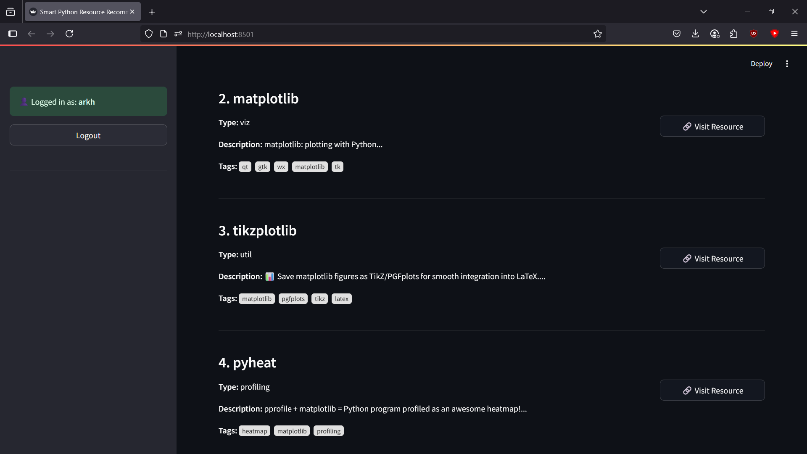

# 🐍 Smart Python Resource Recommendation Engine ✨

A Streamlit application that provides personalized recommendations for Python learning resources (tools, articles, exercises) based on user queries and profiles.

## 🌟 Features

*   **Text-Based Search:** Users can enter natural language queries to find relevant Python resources.
*   **TF-IDF & Cosine Similarity:** Recommendations are powered by TF-IDF vectorization of resource descriptions/tags and cosine similarity matching.
*   **Lemmatization:** NLTK is used for lemmatization to improve search relevance by matching different word forms.
*   **User Profiles:**
    *   Simple username-based login/registration.
    *   Search history is saved and displayed for logged-in users.
*   **Visualizing Graphs:** Consists of graphs to visualize relevance.
*   **Interactive UI:** Built with Streamlit for a user-friendly web interface.
*   **Data-Driven:** Utilizes a CSV dataset (`github_data.csv`) of Python resources.

## 🚀 Live Demo

[Live App on Streamlit Community Cloud](https://smart-python-resource-recommendation-engine.streamlit.app/)

## 📸 Screenshots

* **Home**

* **User Login**

* **Resources Searching**

* **Resources List**


## 🛠️ Tech Stack

*   **Python:** Core programming language.
*   **Streamlit:** For building the interactive web application.
*   **Pandas:** For data manipulation (loading and handling the CSV).
*   **Scikit-learn:** For TF-IDF vectorization and cosine similarity.
*   **NLTK (Natural Language Toolkit):** For text preprocessing (tokenization, lemmatization).
*   **JSON:** For storing user profiles locally.

## 📁 Project Structure

```
AI_Smart_Recommendation_Engine/
├── __init__.py     # Making sure that this folder contains .py files
├── app.py      # Main Streamlit application script
├── github_data.csv     # Dataset of Python resources
├── README.md       # This file
├── recommender.py      # Handles the recommendation logic
├── requirements.txt        # Python package dependencies
├── resource_loader.py      # Loads and processes resource data from CSV
└── user_profiles.json      # Stores user profiles and search history (created on first run)
```


## ⚙️ Setup and Installation

Follow these steps to run the project locally:

1.  **Clone the Repository:**
    ```bash
    git clone https://github.com/Arkya-Bhatt/AI_Smart_Recommendation_Engine.git
    cd AI_Smart_Recommendation_Engine
    ```

2.  **Create and Activate a Virtual Environment:**
    (Recommended to keep dependencies isolated)
    ```bash
    python -m venv venv
    # On Windows
    venv\Scripts\activate
    # On macOS/Linux
    source venv/bin/activate
    ```

3.  **Install Dependencies:**
    ```bash
    pip install -r requirements.txt
    ```

4.  **Download NLTK Resources:**
    The app attempts to download necessary NLTK resources (punkt, wordnet, omw-1.4) on its first run if they are not found. Alternatively, you can download them manually beforehand by running the following in a Python interpreter (within your activated virtual environment):
    ```python
    import nltk
    nltk.download('punkt')
    nltk.download('wordnet')
    nltk.download('omw-1.4')
    nltk.download('punkt_tab')
    ```

5.  **Prepare Data:**
    *   Ensure the `github_data.csv` file is present in the root directory of the project.

## ▶️ Running the Application

Once the setup is complete, run the Streamlit app:

```bash
streamlit run app.py